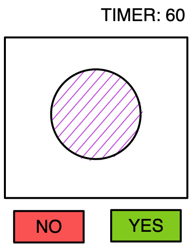

# Minigame Fast Reaction

**Description**  
was the previous image the same as this one?
a fast game about recognising shapes

**Skills**
- Short-Term Memory
- Visual Short-Term Memory
- Inhibition
- Response Time

**Difficulty**  
automatic speed (always faster)

**Result**  
high score

**UI**  
- 12 simple images
- two buttons

**UX**  
- tap Yes or No

**Gameplay:**
- START popup
- a random image is show
- you tap: YES if it the same as previous one, no if different
- a new image is shown
- always faster
- you can make up to 3 errors
- each image is a point

