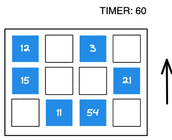

# Minigame Math Order

**Type**
tap the number in ascending (or descending) order before the time finishes.

**difficulty changes** 
- the grid size
- how many numbers are shown
- the "distance" between numbers

**Skills**
- Processing Speed
- Visual Scanning
- Working Memory

**Result**
high score and level progression

**UI**
- Board: grid dynamic (starts at 4\*4 -> 10\*10)
- Elements: colored square with numer (from - 999 to 999)
- some gfx when a cell is done right (+1) or wrong (-1)
- timer
- an arrow to show if to play in ascending or descending

**UX**
tap on a grid cell

**Gameplay:**
- the board is filled with n random numbers
- you are given a direction.
- timer is seto 60 seconds.
- START panel
- you click the numbers
- if you click a correct number, it disapperars with a +1 gfx, and score gets +1
- if you click a wrong number, a gfx with a -1 appears and score gets -1
- if you finish the board, you go to next level. restart timer.
- when the timers ends, the game ends and get score
