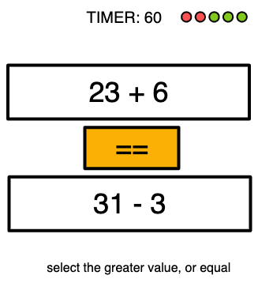

# Minigame Math Speed

**Description**
calculate fast and tap the greater value (or == ) before the time finishes.

**Difficulty** 
the level (1-100) changes automatically these parameters
- the length of the formula
- the distance of the numbers
- how big are the number

**Skills**
- Processing Speed
- Visual Scanning
- Working Memory

**Result**
level progression

**UI**
- two buttons text fields + 1 = button
- timer (with malus and bonus indicators)

**UX**
tap on of the three buttons

**Gameplay:**
- (calculate two numbers based on level)
- timer at 60 seconds
- show the two numbers
- select the greater or the ==
- if you do 5 right in a line, +10 time bonus
- if wrong, timer -3 secs
- until timer ends

