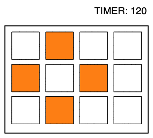

# Minigame Memory Pattern

**Description**  
recreate the given patterns before the time ends.  
memory game

**Skills**
- Non-verbal Memory
- Short-Term Memory
- Visual Short-Term Memory
- Working Memory
- Recognition

**Difficulty**  
the level (1-100) changes automatically these parameters: 
- grid size
- number of cells
- distance of cells

**Result**  
level and high score

**UI**
- Board: dynamic from 2x2 to 10x10
- Elements: colored squares
- timer

**UX**
tap on a grid cell

**Gameplay:**
- START popup
- timer gets to 120
- a pattern of random squared get highlighted for a few seconds.
- then it disappears and  you have to tap the cells.
- if you make an error: timer gets -5 score.
- if you make it, you go to next level
- you play until the timer ends
