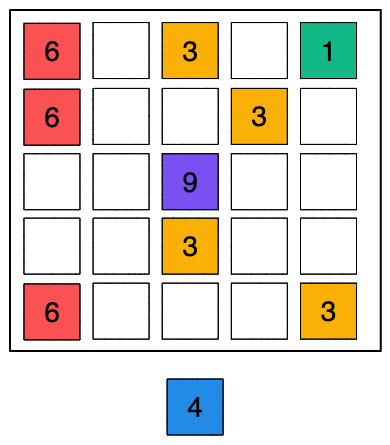

# Minigame Merge

**Description**
score as much as you can by merging blocks.  
mathematical / logical / plan ahead

**Difficulty:** 
the level (1-100) changes automatically this parameter: 
- level 0: give a number likely in the board.
- level 100: give a real random number.

**Result**
high score and level

**UI**
- Board: grid 5x5
- Elements: 9 coloured blocks with numbers from 1 to 9
- some gfx when a block explodes

**UX**
tap on a grid cell

**Gameplay:**
- the board is filled with 12 random blocks
- you are given a random block/number.
- you tap where you want to place it in the grid
- if you make a group of 3 or more squares, they transform to a single block with "number + 1" (in the place where last square was put)
- when you group 3 or more "9" blocks , they "explode" also surrounding blocks
- you score 1 point per block.
- if you can't put any more block, game ends
- the level == the number of plays done with at least a 999 explosion

