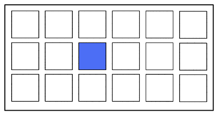

# Minigame Sequence

**Type**
repeat the given sequence as much as you can.
memory game

difficulty: 
- grid size
- sequence length
- speed

**Result**
level

**UI**
- Board: dynamic from 2x2 to 10x10
- Elements: colored squares
- some gfx when a cell is highlighted.

**UX**
tap on a grid cell

**Gameplay:**
- START popup
- a sequence of random squared get highlighted
- you have to repeat the sequence.
- if you make an error: level ends
- if you make it, you go to next level

