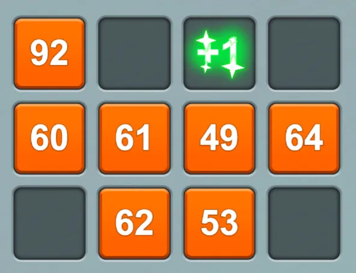
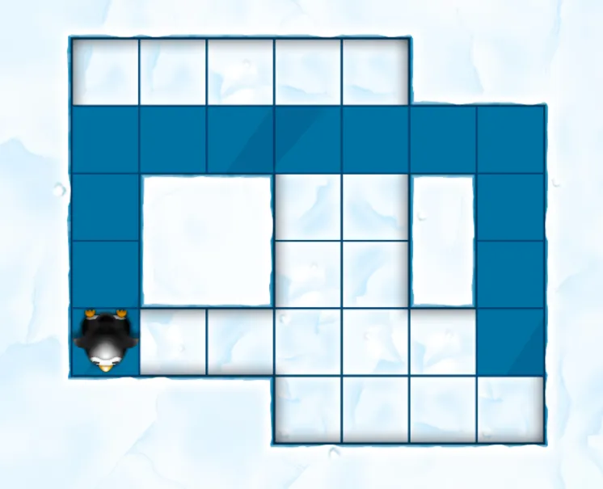
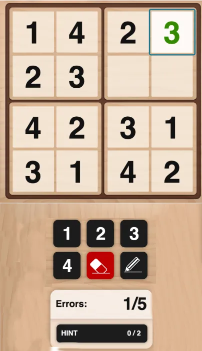
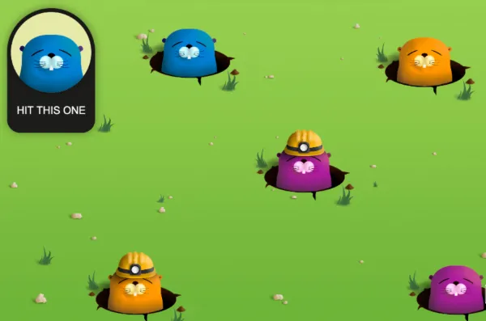

# Minigames
ideas

## Unblock
- Planning
- Spatial Perception

sequential predefined levels

## Digits
- Processing Speed
- Visual Scanning
- Working Memory

random generative levels

## Simon
tap the objects as in the shown sequence

- Non-verbal Memory
- Planning
- Short-Term Memory
- Visual Short-Term Memory
- Working Memory

random generative levels

## Clear the level
move the penguin to clear all level

- Planning
- Spatial Perception

sequential predefined levels

## Sudoku
- Inhibition
- Phonological Short-term Memory
- Planning 
- Spatial Perception

random generative levels

## Whack a Mole

- Inhibition
- Response Time
- Shifting

random generative levels
  
