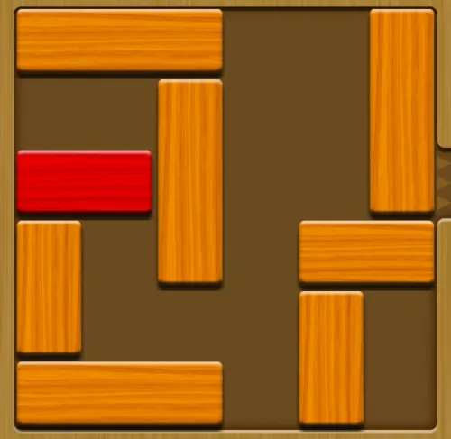
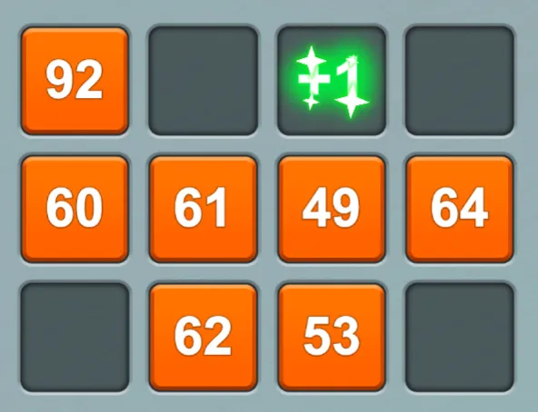
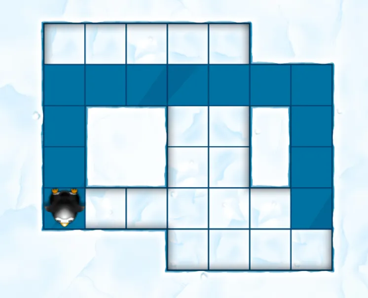
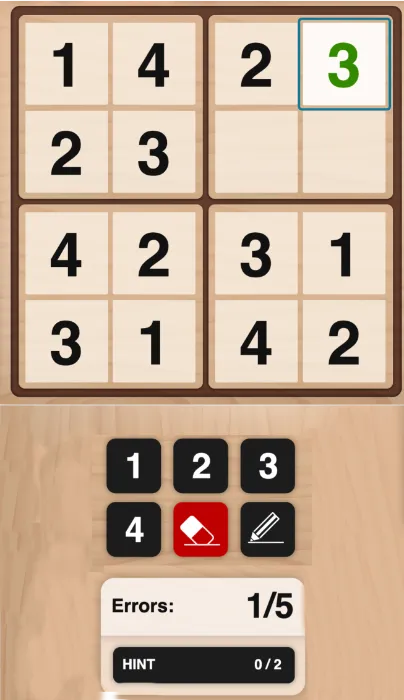

# Activities and Minigames
these are candidates activities and games for the IEEDO app.

# Activities

## Writing Activities

**Skills**
- Language & Literacy
- Emotional
- Social

### Diary
every day or week, write a diary note

### Letter to myself
write a letter to your future self

### Dear friend
write a letter to a friend

# Minigames
## Unblock

slide the blocks to let the red block exit.

**Skills**
- Planning
- Spatial Perception

**Notes**  
- sequential predefined levels
- 200 levels are ready, in progressive order (number of moves to solve)
- we have a level editor to create new levels

## Digits

tap the numers in ascending (or descending) order.

**Skills**
- Processing Speed
- Visual Scanning
- Working Memory

**Notes**  
- random generative levels
- progressive size of the matrix
- progressive amount of numbers
- timer (you have 60s to solve the level)
- errors advance the timer

## Simon

tap the objects as in the shown sequence

**Skills**
- Non-verbal Memory
- Planning
- Short-Term Memory
- Visual Short-Term Memory
- Working Memory

**Notes**  
- random generative levels
- progressive numer of objects
- progressive randomness in the sequences
- later we introduce repetitions

## Clear the level

move the penguin to clear all level

**Skills**
- Planning
- Spatial Perception

**Notes**  
- sequential predefined levels
- need an internal level editor
- in mid difficulties player can get in blocking situations.

## Sudoku

**Skills**
- Inhibition
- Phonological Short-term Memory
- Planning 
- Spatial Perception

**Notes**  
- random generative levels
- progressive board size (stars 4*4 -> 10*10)
- could use letters or symbols

## Whack a Mole

**Skills**
- Inhibition
- Response Time
- Shifting

**Notes**  
- random generative levels
- we can change the Mole with anything else
- progressive difficulties.
- moles with hat need double/triple hits

# Cognitive skills Glossary 

## Attention
### Focused Attention
The ability to focus attention on a single stimulus
### Divided Attention
The ability to execute more than one action at a time, while paying attention to a few channels of information.
### Inhibition
The ability to ignore irrelevant stimuli or suppress irrelevant reactions while performing a task.
### Updating
The ability to respond in a flexible and adaptive manner in order to keep up with the changes in the environment.

## Memory
### Short-Term Memory
The ability to hold a small amount of information in a readily, available state for a short period of time.
### Naming
The ability to retrieve a word from our semantic lexicon and is considered to be a basic ability.
### Working Memory
Refers to the temporary storage and manipulation of the information necessary for complex cognitive tasks.
### Contextual Memory
The conscious recall of the source and circumstances of a specific memory.
### Visual Short-Term Memory
The ability to temporarily retain a small amount of visual information.
### Non-verbal Memory
The ability to store and retrieve information which are non-verbal by nature.
### Phonological Short-term Memory
The ability to remember phonological information over a brief period of time.

## Sensation and Perception
### Auditory perception
Auditory Perception is the ability to perceive and understand the difference between sounds.
### Visual Perception
The ability to interpret information from the effects of visible light reaching the eye.
### Spatial Perception
The ability to evaluate how things are arranged in space, and investigate their relations in the environment.
### Visual Scanning
The ability to actively find relevant information in our surroundings quickly and efficiently.
### Estimation
The ability to estimate an object's future location based on its current speed and distance.
### Width of Field of View
Corresponds to amount of information we receive from around when looking straight ahead.
### Recognition
The ability to retrieve information from the past and to recognize certain events, places or other information.

## Reasoning and Comprehension
### Processing Speed
Involves the ability to fluently perform easy or over-learned tasks.
### Planning
The ability to "think ahead", to mentally anticipate the correct way to execute a task.
### Shifting
Ability to adapt behavior and thoughts to new, changing, or unexpected circumstances

## Coordination
### Hand-eye Coordination
The level of sensitivity with which the hand and eye are synchronized.
### Response Time
The ability to perceive and process a simple stimulus and respond to it.
