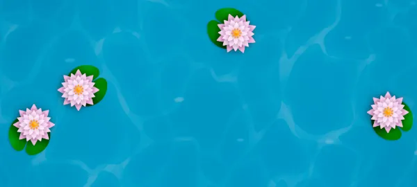

# Activities and Minigames
these are candidates activities and games for the IEEDO app.

# Activities

## Writing Activities

**Skills**
- Language & Literacy
- Emotional
- Social

### Diary
every day or week, write a diary note

### Letter to myself
write a letter to your future self

### Dear friend
write a letter to a friend

# Minigames
## Unblock

slide the blocks to let the red block exit.

**Skills**
- Planning
- Spatial Perception

**Notes**  
- sequential predefined levels
- 200 levels are ready, in progressive order (number of moves to solve)
- we have a level editor to create new levels

## Digits

tap the numers in ascending (or descending) order.

**Skills**
- Processing Speed
- Visual Scanning
- Working Memory

**Notes**  
- random generative levels
- progressive size of the matrix
- progressive amount of numbers
- timer (you have 60s to solve the level)
- errors advance the timer

## Simon

tap the objects as in the shown sequence

**Skills**
- Non-verbal Memory
- Planning
- Short-Term Memory
- Visual Short-Term Memory
- Working Memory

**Notes**  
- random generative levels
- progressive numer of objects
- progressive randomness in the sequences
- later we introduce repetitions

## Clear the level

move the penguin to clear all level

**Skills**
- Planning
- Spatial Perception

**Notes**  
- sequential predefined levels
- need an internal level editor
- in mid difficulties player can get in blocking situations.

## Sudoku

**Skills**
- Inhibition
- Phonological Short-term Memory
- Planning 
- Spatial Perception

**Notes**  
- random generative levels
- progressive board size (stars 4*4 -> 10*10)
- could use letters or symbols

## Whack a Mole

**Skills**
- Inhibition
- Response Time
- Shifting

**Notes**  
- random generative levels
- we can change the Mole with anything else
- progressive difficulties.
- moles with hat need double/triple hits
